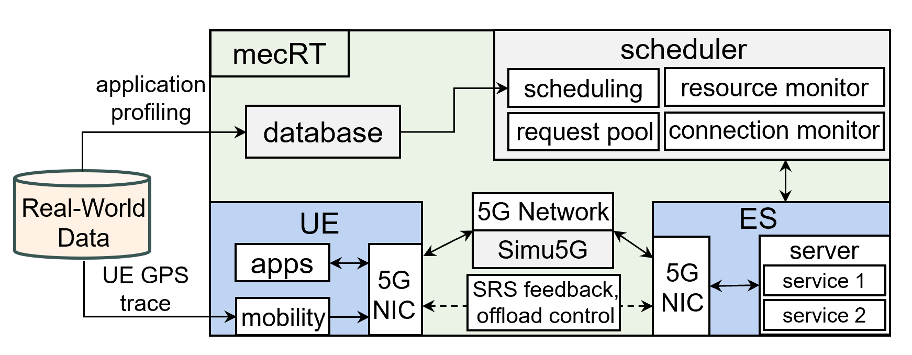

# mecRT: Mobile Edge Computing Simulator for Real-Time Applications  

**mecRT** is an open-source simulator for **Mobile Edge Computing (MEC)** scenarios (previously known as vecSim - vehicular edge computing simulator). It provides a comprehensive framework for modeling **task offloading** and **resource allocation** in heterogeneous 5G-enabled environments. By integrating realistic wireless communication (via **Simu5G**) with edge computing models, mecRT enables researchers to evaluate scheduling strategies for latency-sensitive applications under resource and deadline constraints.  

<center>

</center>

---

## 🔍 Why mecRT?  

Limitations of existing MEC simulators for real-time applications:  

- **iFogSim / EdgeCloudSim**: Good for resource modeling, but **lack 5G network support** and cannot capture real-time channel quality feedback.  
- **Simu5G / Fogbed**: Offer fine-grained 5G network modeling, but **do not support integrated offloading frameworks** that jointly optimize bandwidth and computational resources under deadline constraints.  

**mecRT bridges this gap** by combining realistic **5G-based communication** with a **deadline-aware scheduling framework**. This enables evaluation of various resource management strategies and adaptive offloading control strategies in dynamic MEC environments for real-time applications.  

---

## ✨ Key Features  

- **Task Life Cycle Management**  
  - Service request registration when UEs enter the MEC coverage area.
  - Service deployment on Edge Servers (ESs).
  - Task offloading, execution, and result retrieval with deadline monitoring.
  - Request deregistration upon UE exit.

- **Real-World Data Integration**  
  - Support real-world application executiuon profiling (e.g., execution time, energy consumption). 
  - Configurable application profiles: task type, period, deadline, data size.  
  - Support for **real traffic GPS traces** or synthetic trajectories (e.g., via **SUMO**).  

- **Joint Bandwidth and Computational Resource Optimization**  

- **Adaptive Offloading Control**
  - Enable/Terminate offloading based on service deployment and resource management.
  - Suspend/Resume offloading based on real-time channel quality feedback (i.e., via SRS).
  - Support customizable offloading control policies.

- **5G-Based Communication**  
  - Built on **Simu5G** for realistic 5G-URLLC network modeling.  

- **Customizable Scheduling Policies**  
  - Easily implement, evaluate, and benchmark different scheduling algorithms.
  - Support various scheduling modes:
    - Schedule all requests periodically or only schedule pending requests.
    - Enable/Disable Task Forwarding in wired backhaul network after task being offloaded to ES.
    - Consider/Ignore scheduling overhead.

- **Easy Data Collection and Analysis**  
  - Configurable experiment parameters via one `.ini` file.
  - Easy parameter data logging.
  - Provides scripts for simulation result fetching and analysis.

---

## 🏗️ System Architecture  

A typical mecRT environment consists of:  

- **User Equipments (UEs)** that offload tasks to nearby **Edge Servers (ESs)** via 5G links.  
- **Edge Servers** providing both wireless bandwidth and computational resources.  
- A centralized **Scheduler** that monitors system state and periodically decides offloading and allocation.  

mecRT extends Simu5G with:  
- Online control logic for bandwidth reallocation and suspension under poor channel conditions.  
- Deadline-aware resource allocation for real-time MEC applications.  

---

## 🚀 Installation  

[Installation Instruction](./doc/Installation_Guide.md)

If using WSL2 on windows 10/11, consider additional [GUI setting](./doc/WSL2_Setting.md).

---

## ⚡ Quick Start

1. Run an example simulation:
    ```bash
    cd mecRT/simulations/vec/
    ./run_example.sh
    ```
2. Modify the provided `VEComnetpp.ini` configs to set:
   - Number of UEs and ESs
   - Task periods, deadlines, and data sizes
   - Scheduling policies

3. Visualize Result

---

## 📊 Example Use Cases

- Evaluate deadline-aware **task offloading** algorithms.
- Benchmark adaptive **resource allocation** under variable 5G channel quality.
- Study trade-offs between **latency, throughput, and computational load**.
- Integrate **real-world traces** and **application profiles** for realistic workloads.

---

## 📚 Citation

If you use mecRT in your research, please cite:


---

## 🙏 Acknowledgements
- This project is supported by the [MoE Tier-2 grant MOE-T2EP20221-0006](https://cps-research-group.github.io/cloud/) (Singapore) under the [NTU Cyber-Physical Systems Research Group](https://cps-research-group.github.io/).
- Built on [**OMNeT++**](https://github.com/omnetpp/omnetpp), [**INET**](https://github.com/inet-framework/inet), and [**Simu5G**](https://github.com/Unipisa/Simu5G).

